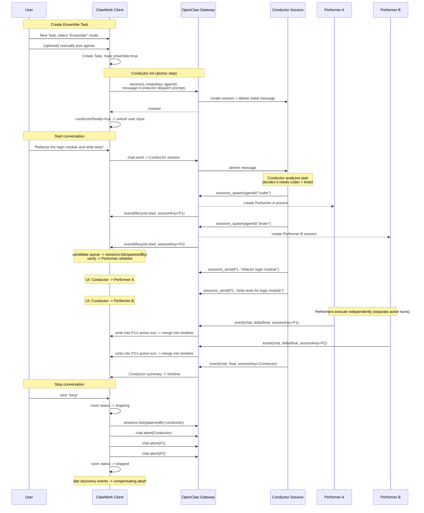
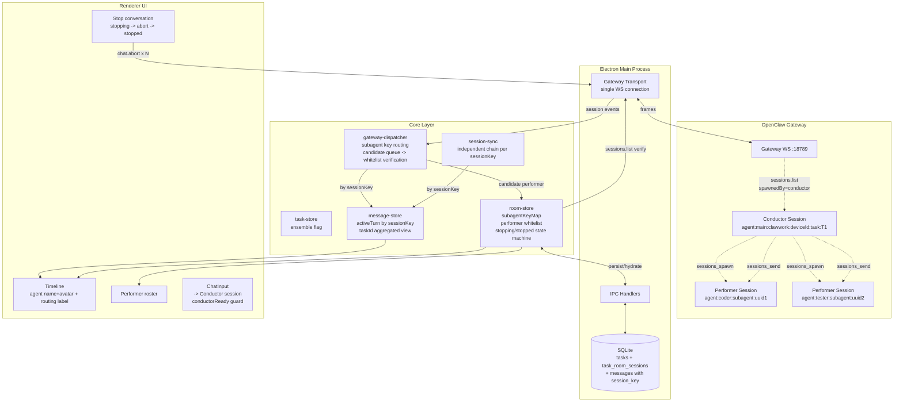

# TaskRoom: ClawWork's Thin Collaboration Layer for Multi-Agent Orchestration

> No external workers. Orchestrate multi-agent collaboration purely with session primitives.

TaskRoom has a simple goal: Task is the product object, a set of sessions is the execution surface, and TaskRoom is the thin collaboration projection in between.

- A normal Task stays `1 Task = 1 session`
- A new `Ensemble Task` = `1 Conductor + N Performers`
- Orchestration is built entirely on OpenClaw's native session primitives — no second external worker system

It's a deliberately thin collaboration layer, currently implemented directly on top of native OpenClaw sessions. The core operations are already isolated behind dependency injection, so extracting them into a standalone `RoomAdapter` interface later is cheap — when we swap to a Matrix or another protocol backend, only the Adapter changes. The product model above it stays put.

## Roles

| Role              | English       | What it does                                                                                                                                                                                                                                                 |
| ----------------- | ------------- | ------------------------------------------------------------------------------------------------------------------------------------------------------------------------------------------------------------------------------------------------------------ |
| **Conductor**     | Conductor     | The coordinator. Does not solve problems directly. Analyzes the task, dynamically picks Performers, dispatches messages, aggregates results. Technically the Task's primary session, seeded with scheduling instructions via `sessions.create(message=...)`. |
| **Performer**     | Performer     | The executor. Runs a concrete task inside an isolated session. Created by the Conductor via `sessions_spawn`, dispatched via `sessions_send`.                                                                                                                |
| **Ensemble Task** | Ensemble Task | A multi-agent Task. The user explicitly selects this mode when creating a Task. 1 Conductor + N Performers.                                                                                                                                                  |

The role model is intentionally restrained. Multi-agent is not a replacement for ClawWork's existing Task model — it's a new task mode layered on top. Implementation complexity concentrates in Performer discovery and stop logic, which we cover later.

**What we're not doing:**

- Not reinventing the message protocol — reuse the existing `Message` model, just add `sessionKey` and a few related fields
- Not building a permission system — the Performer whitelist is derived from Conductor spawn relationships, no ACL
- Not replacing `Task` / `Message` / `Artifact` — these product objects don't move, TaskRoom is only a collaboration projection

## User flow



## Data structures

```text
Task
  |- sessionKey              -> Conductor session
  |- ensemble: boolean       -> is this an Ensemble Task

TaskRoom
  |- taskId
  |- conductorSessionKey     -> = task.sessionKey
  |- conductorReady          -> boolean
  |- status                  -> active | stopping | stopped
  |- performers[]            -> { sessionKey, agentId, agentName, emoji, verifiedAt }

Message
  |- sessionKey              -> source session
  |- agentId                 -> source agent
  |- runId                   -> upstream run id
```

## Message model upgrade

### Key promoted from taskId to sessionKey

A lot of runtime state is still keyed by `taskId` today. That's fine for single-agent, but with multiple sessions streaming at the same time they step on each other.

The upgraded target:

```text
activeTurnBySession[sessionKey]     -> each session has its own active turn
processingBySession.has(sessionKey) -> each session has its own processing flag
messagesByTask[taskId]              -> read-only aggregated view (merged by timestamp)
```

Every message must carry:

- `sessionKey`
- `agentId`
- `runId`

The timeline still renders by Task, but the real isolation unit must be `sessionKey`.

### SQLite message table upgrade

New columns:

| Column        | Type | Meaning         |
| ------------- | ---- | --------------- |
| `session_key` | TEXT | Source session  |
| `agent_id`    | TEXT | Source agent id |
| `run_id`      | TEXT | Upstream run id |

Dedup key:

```text
(task_id, session_key, role, timestamp)
```

Legacy messages are migrated by backfilling `session_key` to `task.sessionKey`.

Core rule: writes are isolated by `sessionKey`, display aggregates by `taskId`.

## OpenClaw capabilities

### Reusable primitives

| Primitive          | Type                         | What it does                                                   |
| ------------------ | ---------------------------- | -------------------------------------------------------------- |
| `sessions_spawn`   | Agent tool                   | Conductor spawns a Performer session                           |
| `sessions_send`    | Gateway `sessions.send`      | Conductor sends a message to a specific Performer              |
| `sessions_history` | Agent tool -> `chat.history` | Fetch session message history                                  |
| `sessions_yield`   | Agent tool                   | Agent yields its current turn                                  |
| `sessions.list`    | Gateway method               | List sessions, supports `spawnedBy` filter                     |
| `sessions.create`  | Gateway method               | Create a session, supports `task`/`message` as initial payload |
| `agents.list`      | Gateway method               | `{ id, name, identity: { name, emoji, avatar } }`              |

> `sessions.create` only landed in OpenClaw 2026.03.18 — mind the version.

### Performer session key format

A session created by `sessions_spawn(agentId:"timi")` gets a key like:

```text
agent:<agentId>:subagent:<uuid>
```

For example:

```text
agent:timi:subagent:d2c7bcdc-37af-4880-ba83-db58c86963da
```

- the key embeds the Performer's `agentId`
- the key does not embed `taskId`
- you cannot route it back to a Task from the key alone
- ownership must be recovered via `sessions.list(spawnedBy=conductorKey)`
- config requirement: `subagents.allowAgents: ["*"]`

### Prerequisite: enable subagent spawn

`allowAgents` is a per-agent setting, not under `agents.defaults`. It must be set explicitly on the agent the Conductor runs as.

`~/.openclaw/openclaw.json`:

```json
{
  "agents": {
    "list": [
      {
        "id": "main",
        "subagents": {
          "allowAgents": ["*"]
        }
      }
    ]
  }
}
```

Without this, `sessions_spawn` from the Conductor comes back with `agentId not allowed`.

### Verified unavailable

- `chat.send` / `sessions.patch` / `sessions.create` do not support system prompt injection
- There is currently no gateway method that sets a system prompt
- `sessions.create` without a `message` argument only creates a record — it does not start the agent process
- `sessions_send` to an empty session does not trigger processing

## Conductor initialization

Conductor init uses:

```text
sessions.create(key, agentId, message=dispatch prompt)
```

Flow:

1. `sessions.create(key, agentId, message=dispatch prompt)`
2. On success, set `conductorReady=true`
3. Block user input until `conductorReady`

### Dispatch prompt template

The system prompt defines the Conductor role, forbids silent fallback to external orchestration paths, and spells out the serial vs. parallel dispatch modes.

```text
You are a task coordinator (Conductor). Your responsibilities:
1. Analyze the user's task and determine if multi-agent collaboration is needed
2. Select appropriate agents (Performers) from the available list using sessions_spawn
3. Dispatch tasks to Performers using sessions_send
4. You do not solve problems directly - you split, dispatch, and summarize
5. When all Performers complete, summarize results for the user

Hard rules:
- For delegated work, you MUST use OpenClaw native session tools only: sessions_spawn and sessions_send.
- Do NOT use coding-agent skills, exec/process background workers, shell-launched copilots, or any external CLI orchestration path.
- Do NOT switch to another execution method if native subagent delegation is available.
- If native delegation fails, report the blocker instead of silently falling back to another worker model.

Dispatch modes:
- Serial: sessions_send(sessionKey, message, timeoutSeconds:30) - blocks until reply
- Parallel: sessions_send(sessionKey, message, timeoutSeconds:0) - fire-and-forget, result pushed back when done
Use serial when the next step depends on this result. Use parallel when multiple steps are independent.

Performer sessions are reusable. You can send multiple messages to the same session for iterative work.

Available agents:
{agentCatalog}

User-selected agents (if any):
{userSelectedAgents}
```

The single most important line is the explicit ban on silently falling back to an external orchestration path. Either go through native OpenClaw session orchestration, or surface the blocker. No silent fallback.

> This is the Tier-1 system-level hard constraint, and it's scoped to orchestration strategy. Tier-2 role definitions are also supported and will be covered separately.

## Conductor <-> Performer communication

Coordination happens on the Conductor agent side (inside OpenClaw). The ClawWork client is not part of the scheduling loop.

### Communication modes

| Mode                             | Behavior                                        | Use case                 |
| -------------------------------- | ----------------------------------------------- | ------------------------ |
| `sessions_send(timeout:30)`      | Blocks, returns the Performer's reply           | Serial coordination      |
| `sessions_send(timeout:0)`       | Fire-and-forget, no wait                        | Parallel dispatch        |
| `sessions_spawn(mode:"run")`     | Non-blocking, result pushed back to Conductor   | One-shot task            |
| `sessions_spawn(mode:"session")` | Create a persistent session, result pushed back | Reusable multi-turn chat |

- Performer sessions are reusable
- OpenClaw subagent results are pushed back to the Conductor automatically
- OpenClaw explicitly reminds you: `Auto-announce is push-based. Do NOT poll.`

### Multi-step collaboration example

```text
Conductor receives user message: "Refactor the login module and write tests"

-- Serial phase: design first --

1. sessions_send(pm-agent, "Design a refactor plan for login module", timeout:30)
   -> blocks -> design doc returned

-- Parallel phase: coding and test design can proceed in parallel --

2. sessions_send(code-agent, "Implement per design: {design doc}", timeout:0)
   sessions_send(test-agent, "Design test cases from: {design doc}", timeout:0)
   -> two Performers work in parallel
   -> each result pushed back to Conductor when done

-- Serial phase: need code before review --

3. Conductor receives code-agent result
   sessions_send(review-agent, "review: {code}", timeout:30)
   -> blocks -> review notes returned

-- Serial phase: need code before running tests --

4. Conductor has test-agent's test cases + code-agent's code
   sessions_send(test-agent, "Run these test cases against this code: {code}", timeout:30)
   -> blocks -> test results returned

-- Iteration phase: loop as needed --

5. Review flagged issues -> sessions_send(code-agent, "Fix: {review notes}", timeout:30)
   Design flaws -> sessions_send(pm-agent, "Adjust: {issues}", timeout:30)
   -> sessions are reused, no respawn needed

6. All green -> Conductor summarizes and replies to the user
```

The example isn't meant as a fixed recipe — it's illustrating a principle: serialize dependency chains, parallelize independent steps, reuse sessions whenever possible.

### User message entry: unicast to Conductor, `@` for direct routing

In an Ensemble Task, multiple agents are online at the same time. If every user message were broadcast to all sessions, it would create a storm of noise — every Performer tries to respond to the same sentence, all talking over each other.

So by default every message goes only to the Conductor, and the Conductor decides whether to dispatch. Users can bypass it with `@` syntax to target a specific session.

| Input         | Target                              | Notes                    |
| ------------- | ----------------------------------- | ------------------------ |
| no `@`        | Conductor                           | Default entry point      |
| `@code-agent` | code-agent session                  | Bypass Conductor, direct |
| `@code @test` | code + test sessions, one copy each | Concurrent send          |
| `@all`        | Conductor + all Performers          | Broadcast                |

When the user targets a Performer directly, a notification is also sent to the Conductor so it doesn't lose context — it learns what the user just said to which Performer.

## Performer discovery

The most grounded and most easily underestimated part of the whole scheme.

A Performer key looks like:

```text
agent:<agentId>:subagent:<uuid>
```

It has no `taskId`, so the client cannot determine ownership by parsing the key alone. We need a two-step process.

### Passive discovery -> candidate queue

```text
Gateway event arrives -> parseTaskIdFromSessionKey(sessionKey)
  |- success (ClawWork-format key) -> normal routing
  |- failure -> isSubagentSession(sessionKey)?
       |- yes -> check registered subagentKeyMap
       |    |- hit -> route by taskId
       |    |- miss -> buffer event + enqueue to global candidate queue
       |- no -> drop (non-ClawWork event)
```

### Authoritative verification -> whitelist

```text
Candidate arrives -> debounce ->
  filter active ensemble tasks by gatewayId
  for each candidate sessionKey:
    for each active ensemble task on the same gateway:
      sessions.list(spawnedBy=conductorSessionKey)
      if candidate sessionKey is in the returned subagent keys:
        register: subagentKeyMap[candidateKey] = { taskId, agentId }
        persist to task_room_sessions table
        if any events arrived early, replay buffered events into message-store
```

Triggers:

- Debounced verification after a candidate event arrives
- Full refetch when a Task is opened
- Re-enumeration after reconnect
- Immediate compensating abort when a new key shows up during `stopping`

This logic is fiddly, but it buys correctness. Since the Gateway broadcasts all session events, ownership must be verified — there's no shortcut.

## Stop conversation

When multiple sessions need to be managed, the old "stop conversation" flow no longer covers the case. Stop still reuses `chat.abort`, but with an added `stopping` intermediate state.

Normal Task:

```text
chat.abort(task.sessionKey)
```

Ensemble Task:

```text
1. room status -> stopping
2. sessions.list(spawnedBy=conductor) -> re-enumerate
3. merge known + newly discovered session keys
4. chat.abort(each sessionKey) concurrently - Promise.allSettled
5. room status -> stopped
```

There's one edge case to handle: **late spawn**.

While in `stopping` or `stopped`, if a new Performer key shows up, we immediately fire another abort for it. Otherwise the user thinks the whole collaboration is stopped, while sessions keep running in the background — which is unacceptable.

## Architecture


