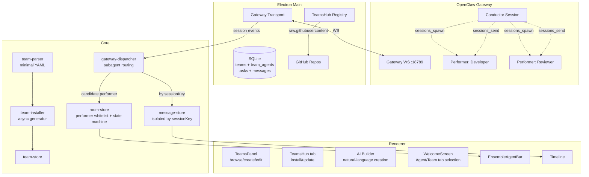

# Teams: Packaging Multi-Agent Collaboration as an Installable Unit

> A skill is an atom, an agent is an entity, a team is a pre-configured set of agents plus a workflow.

v0.0.14 has exactly one theme: Teams. 91 commits, 80 PRs across the whole release.

TaskRoom answered "how do multiple agents run." Team answers "how does the user know how many agents to configure, what each one does, and which workflow to follow." The former is a runtime, the latter is a product wrapper.

## Why Team exists

The most common feedback after TaskRoom shipped wasn't "it doesn't run" — it was "I don't know how many agents I'm supposed to configure."

From the user's point of view, wiring up a multi-agent task means answering a pile of questions: How many agents? What role is each one? What system prompt? Which skills to install? Who is the coordinator? How do they collaborate?

These questions aren't hard for someone who already knows how. But they are an **adoption barrier**, not a capability gap. OpenClaw's runtime primitives are strong enough, ClawWork's Ensemble Task already runs, but the missing piece is a "pick one and go" abstraction.

So the Team definition is simple:

> A Team = a pre-configured set of agents + a workflow definition + the required skills and tools, packaged as an installable, shareable unit.

Team is not a new product layer. It's the product wrapper around the Room runtime.

| Team concept               | Room runtime          | OpenClaw layer           |
| -------------------------- | --------------------- | ------------------------ |
| Manager (coordinator)      | Conductor             | conductor session        |
| Specialist agent (worker)  | Performer             | subagent session         |
| TEAM.md workflow           | Conductor prompt body | `buildConductorPrompt()` |
| Assigning a task to a Team | Ensemble task         | `task.ensemble = true`   |

The three-layer progression:

```text
skill  -> single atomic capability
agent  -> an AI entity with a role, a personality, and skills
team   -> a pre-configured set of agents + workflow, packaged for distribution
```

## Team file layout

A Team is a directory, not a JSON config. Git-native.

```text
<team-name>/
|- TEAM.md              # metadata + workflow
|- agents/
    |- manager/         # required, becomes the Conductor
    |   |- IDENTITY.md
    |   |- SOUL.md
    |   |- skill.json
    |- developer/       # becomes a Performer
    |   |- IDENTITY.md
    |   |- SOUL.md
    |   |- skill.json
    `- reviewer/
    |   |- IDENTITY.md
    |   |- SOUL.md
    |   |- skill.json
```

TEAM.md's frontmatter is metadata; the body is the workflow text.

```yaml
---
name: Software Development Team
description: Full-stack dev team for architecture, implementation, and review.
version: 1.0.0
agents:
  - id: manager
    name: Tech Lead
    role: coordinator
  - id: developer
    name: Developer
    role: worker
  - id: reviewer
    name: Code Reviewer
    role: worker
---

# Workflow

... the collaboration flow written by the Team author ...
```

Each agent has two files:

- `IDENTITY.md` — the role definition. Its `description` field is distilled into the agent catalog the Conductor sees. Lightweight context for dispatch decisions.
- `SOUL.md` — personality, communication style, behavioral traits. Injected into the Performer's subagent session as system context.

The Conductor doesn't need the full identity and soul loaded during orchestration. All it needs is "who this agent is and what they're good at." The full content only loads when the Performer session is spawned.

### No full YAML library in the parser

TEAM.md's frontmatter is a stripped-down YAML subset. Reasons we don't pull in a full YAML parser:

- Fewer dependencies is better, especially ones with a history of parser-level attack surface
- We only need scalars, lists of scalars, and lists of objects — no anchors, aliases, or tags
- Validation rules in the parser itself are more direct than a schema validator

Hard validation rules:

- must have `name`
- must have a non-empty `agents` array
- every agent must have `id` and `role` (`coordinator` or `worker`)
- **must have exactly 1 coordinator**

The last rule directly determines Conductor role assignment — ambiguity is not allowed.

## Layered Conductor prompt

The system prompt the Conductor sees is two segments concatenated:

```text
Layer 1: buildConductorPrompt(agentCatalog)   <- runtime hard constraints, not overridable
Layer 2: TEAM.md body                          <- domain workflow, controlled by Team author
```

Layer 1 is a hard protocol constraint at the system level. Only a handful of rules, but every one of them is a lesson learned:

- Delegated work **must** go through OpenClaw native subagent sessions (`sessions_spawn` / `sessions_send`)
- **Forbidden**: falling back to coding-agent skills, exec background processes, shell-launched copilots, or any side-channel orchestration
- Native delegation failure -> **report the blocker**, do not silently switch to another execution method
- Subagent completion is push-based — **do not** poll `sessions_list` or sleep-wait on state

The last one is the most critical. OpenClaw subagents automatically push results back to the Conductor when done, but without an explicit ban, the LLM's instinct is to write a sleep-then-check loop. An explicit "Do NOT poll" beats any amount of documentation.

Layer 2 is the domain workflow, fully under the Team author's control. It can spell out team goals, division of labor, collaboration pacing, acceptance criteria. What it **cannot change** is how agents talk to each other.

Why this split matters: community-contributed Teams cannot break runtime correctness. No matter what the TEAM.md body says, the Conductor always routes Performers through the correct protocol path.

## Install: turning a Team into a runnable multi-agent

The install flow is a transactional async generator. Every step yields a progress event, and failures roll back.

```text
1. Parse TEAM.md
   |- validate structure
   `- extract agent list

2. For each agent:
   |- agents.create         -> create agent in OpenClaw
   |- agents.files.set      -> write IDENTITY.md
   |- agents.files.set      -> write SOUL.md
   `- skills.install x N    -> install each required skill

3. Persist team metadata in ClawWork's local DB
```

The yield event sequence:

```text
agent_creating -> agent_created
-> file_setting -> file_set
-> skill_installing -> skill_installed
-> team_persisting -> team_persisted
-> done
```

On failure, any already-created agents are rolled back automatically. Either the whole install succeeds or the state returns to the beginning — no intermediate "Team created but skills missing" state is allowed.

### Reinstall safety

`TeamsHub reinstall` reuses existing Gateway agents instead of recreating them. The first cut of this code called `agents.create` on every reinstall, and after some use the user's Gateway ended up littered with orphan agents.

The fix: before install, query `agents.list`. If an agent with the same name exists, just call `agents.files.set` to overwrite its files. Only call `create` when it doesn't exist.

## TeamsHub: Git-native distribution

There's a deliberate stance on distribution: **no centralized API**.

TeamsHub is just a GitHub repository. Each Team is a directory in the repo. ClawWork fetches TEAM.md and agent files via GitHub raw URLs. No registry, no upload review, no API key.

A community registry — `clawwork-ai/teamshub-community` — is built in, and users can add custom GitHub repos as additional registries. Registry ID is the first 12 chars of the URL's SHA256 hash, with path traversal guarded.

Direct wins from Git-native distribution:

- **Zero infrastructure cost** — the registry is a GitHub repo, fork it to run your own
- **Versioning for free** — Team definitions are Git-managed: diff, revert, PR review
- **Community-driven** — contributing a Team means opening a PR

Browsing and installing run entirely through the standalone `TeamsHubTab`:

```text
Teams page -> TeamsHub tab -> pick a Team
  -> preview structure (agents, roles, required skills)
  -> assign gateway and model for each agent
  -> confirm -> install
```

## AI Builder: create a Team in natural language

Manually creating a Team means going through a three-step wizard: fill in team info -> configure each agent -> review & install. For users unfamiliar with multi-agent orchestration, the bar is still high.

AI Builder turns this into a conversation:

```text
User: "I want a research team"
  -> AI breaks down roles, suggests models, generates system prompts
  -> User reviews and tweaks in the right-side panel
  -> Hands off to the standard install flow
```

Implementation-wise it reuses the existing `useSystemSession`. The Agent side already had an AI Builder, so the Team side lines up with the same capability. The AI outputs a `team-config` JSON block that's validated and sanitized into a standard `TeamInfo + AgentDraft[]`, then feeds straight into `useTeamInstall`.

**The AI does not handle skills.** Skills need exact ClawHub slugs, and the LLM's guesses aren't reliable. The next step is to wire up the `skills.search` Gateway RPC and add a debounced search + autocomplete on the right-side panel. Doing nothing beats guessing wrong.

## Performer discovery: the most easily underestimated part

This section is covered in depth in the TaskRoom post. Here I only cover what Teams added.

Performer session key format:

```text
agent:<agentId>:subagent:<uuid>
```

No `taskId`. The Gateway broadcasts all session events, so the client has to verify ownership itself. Two steps:

```text
Gateway event -> parseTaskIdFromSessionKey
  |- success -> normal routing
  `- failure -> isSubagentSession?
       |- yes -> check subagentKeyMap
       |    |- hit -> route by taskId
       |    `- miss -> candidate queue -> debounced sessions.list verification
       `- no -> drop
```

What Teams added is **#319**: stop discovering Performers by consuming session events, and instead discover them by subscribing to `sessions.changed`. Since the Gateway broadcasts everything, running ownership checks only on the consumption path leaves a window open for cross-Task data leaks. Once discovery moves to a subscription, ownership is determined before routing happens. 325 lines of tests guard this boundary.

## What a Team looks like: Software Development Team

The TeamsHub community registry has a few sample Teams today. The most representative is the Software Development Team:

```text
agents:
  - manager: Tech Lead    (coordinator)  -> split work, dispatch, review results
  - developer: Developer  (worker)       -> implement to the design
  - reviewer: Code Reviewer (worker)     -> review code
```

The workflow (Layer 2 body), at its core:

```text
1. Request arrives -> Tech Lead splits into design and implementation phases
2. Design phase -> Tech Lead does the architecture design itself
3. Implementation phase -> sessions_send(developer, design + impl task, serial)
4. Review phase -> sessions_send(reviewer, code + review criteria, serial)
5. Iterate: review flags issues -> sessions_send(developer, fix notes, serial) [session reuse]
6. All green -> summarize result
```

The Layer 2 body only describes "what to do, in what order, with what acceptance criteria." It does not describe "which tool to use for communication." Communication is enforced by Layer 1.

## Architecture



## Landing cadence: 25 PRs across a week

Bottom-up, each layer stabilized before building the next one on top of it. All dates below are real merge dates.

**Apr 1 (Wed) — TaskRoom prerequisite**

- **#210** Multi-agent runtime lands. Conductor / Performer, candidate queue, whitelist, `stopping` state machine, message isolation by sessionKey — all in one PR. Without it, Teams would be an empty shell.

**Apr 2 (Thu) — UI shell + skill template**

- **#258** TeamsPanel UI shell, left nav entry, card layout, i18n
- **#259** team-creator skill, a Claude Code-assisted creation skill template

**Apr 3 (Fri) — Data layer**

- **#260** EnsembleAgentBar, the multi-agent avatar bar component
- **#262** Team data model, SQLite schema, Zustand store, IPC handlers

Two tables: `teams` (team metadata) and `team_agents` (membership, composite primary key `teamId + agentId`). Membership updates run inside a transaction: delete all `team_agents`, re-insert.

**Apr 4–5 (Weekend) — off**

**Apr 6 (Mon) — engine**

- **#266** Wire Team start-chat to the Room runtime, task-store ensemble support
- **#268** TEAM.md parser + team-installer orchestrator, async generator, rollback

**Apr 7 (Tue) — the burst day, beta.1 tagged**

Nine PRs in one day — TeamsHub end-to-end + Team detail page + a handful of fixes:

- **#270** Multi-step create Wizard, replacing the simple CreateTeamDialog
- **#282** Team detail view, virtual file tree + inline editor, directly edit IDENTITY.md / SOUL.md
- **#283** Agent description, a configurable description used for the Conductor's agent catalog
- **#288** TeamsHub data layer, Git-native registry download, cache, path traversal guard
- **#290** TeamsHub browse UI, TeamsHubTab, RegistryManageDialog
- **#294** TeamsHub install flow, TeamHubDetailView, useTeamHubInstall
- **#295** Defer Task creation — Team chat only creates a Task on the first message sent
- **#296** Team detail view layout unification
- **#299** Reinstall safety — TeamsHub reinstall reuses existing Gateway agents

**v0.0.14-beta.1** was tagged at the end of this day.

**Apr 8 (Wed) — AI Builder + runtime hardening**

- **#303** AI Builder dialog, two-pane layout: left AI chat + right live config preview
- **#304** WelcomeScreen refactor, tab-based Agent / Team / orchestrate mode selection
- **#310 / #311** Ensemble flag persistence, keeping WelcomeScreen tab switching and Task switching consistent
- **#313** Terminology unification — repo-wide switch to coordinator / worker, replacing the earlier mixed manager / specialist usage
- **#319** Subagent event routing via `sessions.changed` subscription, preventing cross-Task data leaks
- **#320** Extract WelcomeScreen gateway selector hook
- **#321** Teams panel button visual hierarchy fix

**Apr 9 (Thu) — v0.0.14 shipped**

## Unfinished work

**RoomAdapter abstraction.** OpenClaw operations are already isolated behind dependency injection, but spread across three deps interfaces. The plan is to extract a unified `RoomAdapter` interface:

```typescript
interface RoomAdapter {
  createConductorSession(gatewayId, params);
  sendToSession(gatewayId, sessionKey, content);
  abortSession(gatewayId, sessionKey);
  listPerformerSessions(gatewayId, conductorSessionKey);
  isPerformerSession(sessionKey): boolean;
  parseSessionKey(sessionKey): { agentId?; taskId?; isSubagent };
  buildConductorPrompt(agentCatalog): string;
}
```

Cost is low (~200 lines), zero business change. The point isn't to switch protocol backends now — it's so that when we eventually wire up Matrix or another protocol, the orchestration layer doesn't need to be rewritten.

**Observability.** Multi-agent debugging is a real pain point. The plan is a single `traceId` threaded through the Conductor and all Performers, IPC-level start/success/failure logs, and renderer-side state transition tracing.

**Skills search.** AI Builder doesn't touch skills today. Once `skills.search` Gateway RPC is wired up, add debounced search + autocomplete in the UI.

**Team versioning.** The `version` field in TEAM.md already exists, but there's no upgrade flow yet. Next step: TeamsHub detects a new version -> prompts the user -> runs diff preview -> reinstall.
