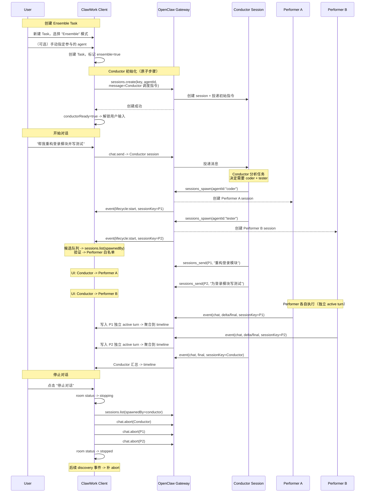
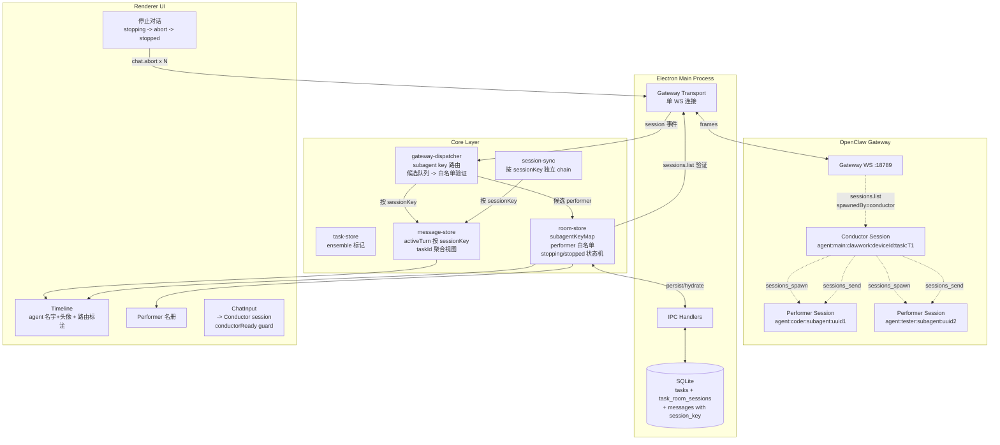

# TaskRoom 薄协作层：ClawWork 的多 Agent 编排设计

> 不加外部 worker，纯 session 原语编排多 Agent

TaskRoom 核心目标很简单，Task 是产品对象，session 集合是执行面，TaskRoom 是中间的薄协作投影。

- 普通 Task 继续保持 `1 Task = 1 session`
- 新增一种 `Ensemble Task` = `1 Conductor + N Performer`
- 编排完全建立在 OpenClaw 原生 session 原语上，不引入另一套外部 worker 体系

它是一个很薄的协作层，当前直接基于 OpenClaw 原生 session 实现。核心操作已通过 deps 注入隔离，后续抽取为独立 `RoomAdapter` 接口的成本很低——届时换到 Matrix 或其他协议后端，只替换 Adapter，上层产品模型不动。

## 角色定义

| 角色              | 英文          | 说明                                                                                                                                                         |
| ----------------- | ------------- | ------------------------------------------------------------------------------------------------------------------------------------------------------------ |
| **Conductor**     | Conductor     | 调度者。不直接解决问题。分析任务、动态选择 Performer、分派消息、汇总结果。本质是 Task 的 primary session，通过 `sessions.create(message=...)` 注入调度指令。 |
| **Performer**     | Performer     | 执行者。在独立 session 中执行具体任务。由 Conductor 通过 `sessions_spawn` 创建，`sessions_send` 分派。                                                       |
| **Ensemble Task** | Ensemble Task | 多 Agent 任务。用户创建 Task 时显式选择。1 Conductor + N Performer。                                                                                         |

角色模型是有意保持克制的，多 Agent 不是替换 ClawWork 现有任务模型，而是在现有模型上增加一种新的任务模式。实现层的复杂度集中在后面的 Performer 发现和停止逻辑上。

**什么不做：**

- 不重造消息协议——复用现有 `Message` 模型，只加 `sessionKey` 等字段
- 不做复杂权限系统——Performer 白名单由 Conductor spawn 关系决定，不引入 ACL
- 不替代 `Task` / `Message` / `Artifact`——这些产品对象不动，TaskRoom 只是协作投影

## 用户操作流程



## 数据结构

```text
Task
  |- sessionKey              -> Conductor session
  |- ensemble: boolean       -> 是否 Ensemble Task

TaskRoom
  |- taskId
  |- conductorSessionKey     -> = task.sessionKey
  |- conductorReady          -> boolean
  |- status                  -> active | stopping | stopped
  |- performers[]            -> { sessionKey, agentId, agentName, emoji, verifiedAt }

Message
  |- sessionKey              -> 来源 session
  |- agentId                 -> 来源 agent
  |- runId                   -> 上游 run 标识
```

## 消息模型升级

### 主键从 taskId 提升到 sessionKey

当前很多运行时状态还是按 `taskId` 管理。单 Agent 没问题，多 session 同时 streaming 会导致互踩。

升级后的目标是：

```text
activeTurnBySession[sessionKey]     -> 每个 session 独立 active turn
processingBySession.has(sessionKey) -> 每个 session 独立 processing
messagesByTask[taskId]              -> 只读聚合视图（按时间戳合并）
```

每条消息都要携带：

- `sessionKey`
- `agentId`
- `runId`

最终 timeline 仍然按 Task 展示，但真正的隔离单位必须是 `sessionKey`。

### SQLite 消息表升级

新增字段：

| 字段          | 类型 | 说明             |
| ------------- | ---- | ---------------- |
| `session_key` | TEXT | 消息来源 session |
| `agent_id`    | TEXT | 来源 agent id    |
| `run_id`      | TEXT | 上游 run 标识    |

去重键：

```text
(task_id, session_key, role, timestamp)
```

旧消息迁移时，`session_key` 回填为 `task.sessionKey`。

核心原则：写入按 `sessionKey` 隔离，展示按 `taskId` 聚合。

## OpenClaw 能力边界

### 可复用原语

| 原语               | 类型                         | 说明                                              |
| ------------------ | ---------------------------- | ------------------------------------------------- |
| `sessions_spawn`   | Agent tool                   | Conductor spawn Performer session                 |
| `sessions_send`    | Gateway `sessions.send`      | Conductor 向指定 Performer 发消息                 |
| `sessions_history` | Agent tool -> `chat.history` | 获取 session 消息历史                             |
| `sessions_yield`   | Agent tool                   | agent 让出当前 turn                               |
| `sessions.list`    | Gateway method               | 列出 session，支持 `spawnedBy` 过滤               |
| `sessions.create`  | Gateway method               | 创建 session，支持 `task`/`message` 作为初始消息  |
| `agents.list`      | Gateway method               | `{ id, name, identity: { name, emoji, avatar } }` |

> `sessions.create` 是 OpenClaw 2026.03.18 才支持的，注意版本

### Performer session key 格式

`sessions_spawn(agentId:"timi")` 创建的 session key 格式为：

```text
agent:<agentId>:subagent:<uuid>
```

例如：

```text
agent:timi:subagent:d2c7bcdc-37af-4880-ba83-db58c86963da
```

- key 中包含 performer 的 `agentId`
- key 中不包含 `taskId`
- 无法从 key 直接路由回 Task
- 需要通过 `sessions.list(spawnedBy=conductorKey)` 反查归属关系
- 配置要求：`subagents.allowAgents: ["*"]`

### 前置配置：启用 subagent spawn

`allowAgents` 是 per-agent 配置，不在 `agents.defaults` 下，需要在 Conductor 所用 agent 上显式设置。

`~/.openclaw/openclaw.json`：

```json
{
  "agents": {
    "list": [
      {
        "id": "main",
        "subagents": {
          "allowAgents": ["*"]
        }
      }
    ]
  }
}
```

如果没有这项配置，Conductor 调用 `sessions_spawn` 时 Gateway 会返回 `agentId not allowed`。

### 已验证不可用

- `chat.send` / `sessions.patch` / `sessions.create` 都不支持 system prompt 注入
- 当前没有 gateway method 可以设置 system prompt
- `sessions.create` 不带 `message` 参数时只创建记录，不启动 agent 进程
- `sessions_send` 发送到空 session 不会触发处理

## Conductor 初始化

Conductor 初始化使用：

```text
sessions.create(key, agentId, message=调度指令)
```

初始化流程：

1. `sessions.create(key, agentId, message=调度指令)`
2. 成功后 `conductorReady=true`
3. `conductorReady` 之前禁止用户发消息

### 调度指令模板

system prompt: 定义 Conductor 角色、禁止 silent fallback 到外部编排路径、区分串行/并行 dispatch 模式。

```text
You are a task coordinator (Conductor). Your responsibilities:
1. Analyze the user's task and determine if multi-agent collaboration is needed
2. Select appropriate agents (Performers) from the available list using sessions_spawn
3. Dispatch tasks to Performers using sessions_send
4. You do not solve problems directly - you split, dispatch, and summarize
5. When all Performers complete, summarize results for the user

Hard rules:
- For delegated work, you MUST use OpenClaw native session tools only: sessions_spawn and sessions_send.
- Do NOT use coding-agent skills, exec/process background workers, shell-launched copilots, or any external CLI orchestration path.
- Do NOT switch to another execution method if native subagent delegation is available.
- If native delegation fails, report the blocker instead of silently falling back to another worker model.

Dispatch modes:
- Serial: sessions_send(sessionKey, message, timeoutSeconds:30) - blocks until reply
- Parallel: sessions_send(sessionKey, message, timeoutSeconds:0) - fire-and-forget, result pushed back when done
Use serial when the next step depends on this result. Use parallel when multiple steps are independent.

Performer sessions are reusable. You can send multiple messages to the same session for iterative work.

Available agents:
{agentCatalog}

User-selected agents (if any):
{userSelectedAgents}
```

这里最重要的一条，是明确禁止偷偷降级到外部编排路径。要么走 OpenClaw 原生 session 编排，要么暴露阻塞点，不做 silent fallback。

> 现在做的是 Tier1 系统层的硬限制主要限定编排策略。 Tier2 也支持进行角色定义，这个后续会展开。

## Conductor 与 Performer 通信

协调发生在 Conductor 的 agent 侧（OpenClaw），ClawWork 客户端不参与调度逻辑。

### 通信模式

| 方式                             | 行为                               | 用途           |
| -------------------------------- | ---------------------------------- | -------------- |
| `sessions_send(timeout:30)`      | 阻塞等待，返回 Performer 回复      | 串行协调       |
| `sessions_send(timeout:0)`       | fire-and-forget，不等回复          | 并行分派       |
| `sessions_spawn(mode:"run")`     | 不阻塞，完成后推送结果回 Conductor | 一次性任务     |
| `sessions_spawn(mode:"session")` | 创建持久 session，完成后推送结果   | 可复用多轮对话 |

- Performer session 可复用
- OpenClaw subagent 完成后会把结果回推给 Conductor
- OpenClaw 已经明确提示 `Auto-announce is push-based. Do NOT poll.`

### 多步协作示例

```text
Conductor 收到用户消息: "重构登录模块并写测试"

-- 串行阶段：设计先行 --

1. sessions_send(pm-agent, "设计登录模块重构方案", timeout:30)
   -> 阻塞 -> 拿到设计文档

-- 并行阶段：编码和测试用例设计可以同时进行 --

2. sessions_send(code-agent, "按设计编码: {设计文档}", timeout:0)
   sessions_send(test-agent, "设计测试用例: {设计文档}", timeout:0)
   -> 两个 Performer 并行工作
   -> 各自完成后结果推送回 Conductor

-- 串行阶段：需要代码才能 review --

3. Conductor 收到 code-agent 结果
   sessions_send(review-agent, "review: {代码}", timeout:30)
   -> 阻塞 -> 拿到 review 意见

-- 串行阶段：需要代码才能跑测试 --

4. Conductor 收到 test-agent 的测试用例 + code-agent 的代码
   sessions_send(test-agent, "用测试用例跑这段代码: {代码}", timeout:30)
   -> 阻塞 -> 拿到测试结果

-- 迭代阶段：按需回路 --

5. review 有问题 -> sessions_send(code-agent, "修复: {review 意见}", timeout:30)
   设计有问题 -> sessions_send(pm-agent, "调整: {问题}", timeout:30)
   -> session 复用，不需要重新 spawn

6. 全部通过 -> Conductor 汇总结果回复用户
```

这个例子表达的其实不是“固定流程”，而是一个原则：依赖链要串行，独立步骤要并行，session 尽量复用。

### 用户消息入口：单播 Conductor，按需 @ 定向

Ensemble Task 里多个 agent 同时在线，如果用户每条消息都广播给所有 session，会产生消息噪音风暴，每个 Performer 都试图响应同一句话，互相冲突。
所以默认只投递给 Conductor，由它决定是否分派。用户也可以用 `@` 语法绕过 Conductor 定向发送。

| 输入          | 路由目标                   | 说明                    |
| ------------- | -------------------------- | ----------------------- |
| 无 `@`        | Conductor                  | 默认入口                |
| `@code-agent` | code-agent session         | 绕过 Conductor 直接对话 |
| `@code @test` | code + test session 各一份 | 并发发送                |
| `@all`        | Conductor + 所有 Performer | 广播                    |

用户直接 `@Performer` 时，为了不让 Conductor 丢上下文，会自动补发一条通知给 Conductor，告诉它用户刚刚对哪个 Performer 说了什么。

## Performer 发现

这是整个方案里最现实、也最容易被轻视的一环。

因为 Performer key 长这样：

```text
agent:<agentId>:subagent:<uuid>
```

它没有 `taskId`，所以客户端不能只靠 parse key 做归属判断。必须两步走。

### 被动发现 -> 候选队列

```text
Gateway 事件到达 -> parseTaskIdFromSessionKey(sessionKey)
  |- 成功（ClawWork 格式 key）-> 正常路由
  |- 失败 -> isSubagentSession(sessionKey)?
       |- 是 -> 检查已注册 subagentKeyMap
       |    |- 命中 -> 按 taskId 正常路由
       |    |- 未命中 -> 缓存事件 + 投入全局候选队列
       |- 否 -> 丢弃（非 ClawWork 事件）
```

### 权威验证 -> 白名单

```text
候选到达 -> debounce ->
  按 gatewayId 过滤 active ensemble task
  for each candidate sessionKey:
    for each active ensemble task on same gateway:
      sessions.list(spawnedBy=conductorSessionKey)
      if candidate sessionKey in returned subagent keys:
        注册: subagentKeyMap[candidateKey] = { taskId, agentId }
        持久化到 task_room_sessions 表
        如候选期间确实有早到事件，再 replay 缓存事件到 message-store
```

触发时机：

- 候选事件到达后 debounce 验证
- Task 打开时全量拉取
- 重连后重新枚举
- `stopping` 态新 key 到达时立即补 abort

这套逻辑虽然比较麻烦，但好处是保证了正确性。因为 Gateway 会广播所有 session 事件，归属关系必须进行验证。

## 停止对话

当 多个 Session 需要进行管理时，现在的停止会话就不能满足场景了。停止对话复用 `chat.abort`，但要增加 `stopping` 中间态。

普通 Task：

```text
chat.abort(task.sessionKey)
```

Ensemble Task：

```text
1. room status -> stopping
2. sessions.list(spawnedBy=conductor) -> 重新枚举
3. 合并已知 + 新发现的 session key
4. 并发 chat.abort(每个 sessionKey) - Promise.allSettled
5. room status -> stopped
```

还要处理一个边界条件：late spawn。

也就是 `stopping` 或 `stopped` 状态下，如果又发现新的 Performer key，必须立即补一次 abort。否则用户以为已经停掉整组协作，后台却还有 session 在继续跑，这种行为是不能接受的。

## 架构图


