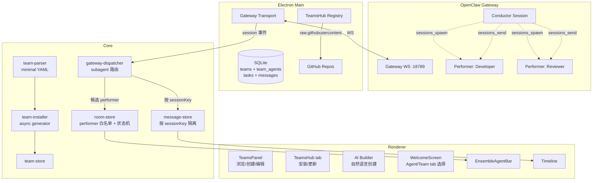

# Teams：把多 Agent 协作打包成可安装单元

> skill 是原子，agent 是实体，team 是一组预配置好的 agents 加工作流。

v0.0.14 的主题只有一个词：Teams。整个版本 91 个 commit、80 个 PR。

TaskRoom 解决的是"多 Agent 怎么跑"。Team 解决的是"用户怎么知道该配几个 Agent、分别干什么、按什么工作流协作"。前者是运行时，后者是产品封装。

## 为什么要有 Team

TaskRoom 上线之后，最直接的反馈不是"跑不起来"，而是"我不知道该配几个 Agent"。

从用户视角看，配一个多 Agent 任务要回答一堆问题：要几个 agent？分别什么角色？用什么 system prompt？装哪些 skill？谁是 coordinator？怎么协作？

这些问题对会用的人不难，但它们是**采纳障碍**，不是能力问题。OpenClaw 的运行时原语已经够强了，ClawWork 的 Ensemble Task 也能跑，缺的是一个"选一下就能用"的抽象。

所以 Team 的定位很明确：

> 一个 Team = 一组预配置好的 agents + 一份工作流定义 + 必要的 skills 和 tools，打包为一个可安装、可分享的单元。

Team 不是新的产品层。它是 Room 运行时的产品化封装。

| Team 概念            | Room 运行时           | OpenClaw 层              |
| -------------------- | --------------------- | ------------------------ |
| Manager（协调者）    | Conductor             | conductor session        |
| 专业 Agent（执行者） | Performer             | subagent session         |
| TEAM.md 工作流       | Conductor prompt body | `buildConductorPrompt()` |
| 把任务分配给 Team    | Ensemble task         | `task.ensemble = true`   |

三层递进：

```text
skill  -> 单一原子能力
agent  -> 有角色、性格、技能的 AI 实体
team   -> 一组预配置 agents + 工作流，打包分发
```

## Team 的文件结构

Team 是一个目录，不是一个 JSON 配置。Git 原生。

```text
<team-name>/
|- TEAM.md              # 元数据 + 工作流
|- agents/
    |- manager/         # 必需，成为 Conductor
    |   |- IDENTITY.md
    |   |- SOUL.md
    |   |- skill.json
    |- developer/       # 成为 Performer
    |   |- IDENTITY.md
    |   |- SOUL.md
    |   |- skill.json
    `- reviewer/
    |   |- IDENTITY.md
    |   |- SOUL.md
    |   |- skill.json
```

TEAM.md 的 frontmatter 是元数据，body 是工作流文本。

```yaml
---
name: Software Development Team
description: Full-stack dev team for architecture, implementation, and review.
version: 1.0.0
agents:
  - id: manager
    name: Tech Lead
    role: coordinator
  - id: developer
    name: Developer
    role: worker
  - id: reviewer
    name: Code Reviewer
    role: worker
---

# Workflow

... Team 作者写的协作流程 ...
```

每个 agent 有两个文件：

- `IDENTITY.md` - 角色定义。其 `description` 字段会被提炼进 Conductor 看到的 agent catalog，轻量上下文用于分派决策
- `SOUL.md` - 性格、沟通风格、行为特征。注入 performer 的 subagent session 作为系统上下文

Conductor 不需要在编排时加载完整 identity 和 soul，它只需要知道"这个 Agent 是谁、擅长什么"就够了。完整内容只有当 performer session 被 spawn 时才会加载进去。

### parser 不引入完整 YAML 库

TEAM.md 的 frontmatter 是一个精简的 YAML 子集，不用完整 YAML parser 是因为：

- 依赖越少越好，尤其是 parser 这种有历史攻击面的东西
- 只需要支持 scalar、list of scalar、list of object，不需要 anchor / alias / tag
- 校验规则写在 parser 里，比用 schema validator 更直接

校验硬约束：

- 必须有 `name`
- 必须有非空 `agents` 数组
- 每个 agent 必须有 `id` 和 `role`（`coordinator` 或 `worker`）
- **必须恰好 1 个 coordinator**

最后一条直接决定了 Conductor 的角色归属，不允许模糊。

## Conductor 的 prompt 分层

Conductor 收到的 system prompt 是两段拼起来的：

```text
Layer 1: buildConductorPrompt(agentCatalog)   <- 运行时硬约束，不可覆盖
Layer 2: TEAM.md body                          <- 领域工作流，Team 作者控制
```

Layer 1 是系统层的硬性协议约束。核心规则只有几条，但每条都是踩过的坑：

- 委派工作 **必须** 走 OpenClaw 原生 subagent session（`sessions_spawn` / `sessions_send`）
- **禁止** 降级到 coding-agent skills、exec 后台进程、shell 启动的 copilot、或任何旁路编排
- 原生委派失败 -> **报告阻塞**，而不是静默切换到其他执行方式
- 子任务完成是 push-based，**禁止** 轮询 `sessions_list` 或 sleep 等状态

最后一条最关键。OpenClaw subagent 完成后会自动把结果推送回 Conductor，但不显式禁止，LLM 的本能是写 sleep-then-check 循环。加一条明确的 "Do NOT poll" 胜过任何文档。

Layer 2 是 Team 作者完全控制的领域工作流。可以写团队目标、分工策略、协作节奏、验收标准。但它**不能改变** agents 之间的通信方式。

这种分层的好处：社区贡献的 Team 无法破坏运行时的正确性。无论 TEAM.md body 怎么写，Conductor 始终通过正确的协议路径编排 Performer。

## 安装：把一个 Team 变成可运行的多 Agent

安装流程是一个事务性 async generator，每一步 yield 进度事件，失败回滚。

```text
1. 解析 TEAM.md
   |- 校验结构
   `- 提取 agent 列表

2. 对每个 agent：
   |- agents.create         -> 在 OpenClaw 创建 agent
   |- agents.files.set      -> 写入 IDENTITY.md
   |- agents.files.set      -> 写入 SOUL.md
   `- skills.install x N    -> 安装所需的每个 skill

3. 在 ClawWork 本地 DB 存储 team 元数据
```

yield 的事件序列：

```text
agent_creating -> agent_created
-> file_setting -> file_set
-> skill_installing -> skill_installed
-> team_persisting -> team_persisted
-> done
```

失败时自动回滚已创建的 agents。要么全部成功，要么回到初始状态——不允许"Team 创建了但没装 skill"这种中间态。

### 重装安全

`TeamsHub reinstall` 时复用已有的 Gateway agent，不重复创建。一开始的实现是每次 reinstall 都重新 `agents.create`，结果用户用了一段时间之后 Gateway 上挂着一堆孤儿 agent。

改成：安装前先查 `agents.list`，如果同名 agent 已存在，直接 `agents.files.set` 覆盖文件即可，只有不存在时才 `create`。

## TeamsHub：Git 原生分发

分发方式上有一个明确的立场：**不做中心化 API**。

TeamsHub 就是一个 GitHub 仓库。每个 Team 是仓库里的一个目录。ClawWork 通过 GitHub raw URL 拉 TEAM.md 和 agent 文件。没有注册中心、没有上传审核、没有 API key。

内置了一个社区注册表 `clawwork-ai/teamshub-community`，用户也可以添加自定义 GitHub 仓库作为注册表。注册表 ID 是 URL 的 SHA256 哈希前 12 位，做了路径遍历防护。

Git 原生分发的直接收益：

- **零基础设施成本** - 注册表就是 GitHub repo，fork 即可自建
- **版本控制天然** - Team 定义是 Git 管理的，可以 diff、revert、PR review
- **社区驱动** - 贡献一个 Team 就是提一个 PR

浏览和安装流程在 UI 上走完全独立的 `TeamsHubTab`：

```text
Teams 页 -> TeamsHub tab -> 选一个 Team
  -> 预览结构（agents、角色、所需 skills）
  -> 为每个 Agent 分配 gateway 和 model
  -> 确认 -> 安装
```

## AI Builder：自然语言创建 Team

手动创建 Team 要走三步 wizard：填团队信息 -> 逐个配 Agent -> review & install。对不熟悉多 Agent 编排的用户来说，门槛还是高。

AI Builder 把这个问题转化为对话：

```text
用户: "我想要一个做研究的团队"
  -> AI 拆解角色分工、建议 model、生成 system prompt
  -> 用户在右面板 review 和微调
  -> 对接标准安装流程
```

实现上复用了已有的 `useSystemSession`。Agent 侧已经有 AI Builder，Team 侧对齐这套能力。AI 输出 `team-config` JSON 块，经过校验和 sanitize 转为标准的 TeamInfo + AgentDraft[]，直接走 `useTeamInstall`。

**AI 不处理 skills**。Skills 需要精确的 ClawHub slug，LLM 猜不靠谱。下一步计划接入 `skills.search` Gateway RPC，在右面板做 debounced 搜索 + autocomplete。不做比乱猜好。

## Performer 发现：最容易被忽略的一环

这部分在 TaskRoom 那篇文章里展开过，这里只讲 Teams 给它加了什么。

Performer session key 格式：

```text
agent:<agentId>:subagent:<uuid>
```

没有 `taskId`。Gateway 广播所有 session 事件，客户端必须自己做归属验证。两步走：

```text
Gateway 事件 -> parseTaskIdFromSessionKey
  |- 成功 -> 正常路由
  `- 失败 -> isSubagentSession?
       |- 是 -> 检查 subagentKeyMap
       |    |- 命中 -> 按 taskId 路由
       |    `- 未命中 -> 候选队列 -> debounced sessions.list 验证
       `- 否 -> 丢弃
```

Teams 带来的改动是 **#319**：不再靠消费 session 事件时发现 performer，改成订阅 `sessions.changed` 主动发现。Gateway 广播所有事件，如果只在消费路径做归属判断，跨 Task 数据泄漏的窗口无法关闭。改成订阅拉取之后，归属关系的确定被前置到路由之前，325 行测试守着这个边界。

## 一个 Team 长什么样：Software Development Team

TeamsHub 社区注册表里目前有几个示例 Team，最典型的一个是 Software Development Team：

```text
agents:
  - manager: Tech Lead    (coordinator)  -> 拆任务、分派、review 结果
  - developer: Developer  (worker)       -> 按设计编码
  - reviewer: Code Reviewer (worker)     -> review 代码
```

工作流（Layer 2 body）的核心是：

```text
1. 收到需求 -> Tech Lead 拆分为设计和实现两个阶段
2. 设计阶段 -> Tech Lead 自己完成架构设计
3. 实现阶段 -> sessions_send(developer, 设计 + 实现任务, serial)
4. Review 阶段 -> sessions_send(reviewer, 代码 + review 标准, serial)
5. 迭代: review 有问题 -> sessions_send(developer, 修复意见, serial) [session 复用]
6. 全部通过 -> 汇总结果
```

Layer 2 body 只描述"做什么、什么顺序、什么验收标准"，不描述"用哪个工具通信"。通信方式由 Layer 1 强制。

## 架构



## 25 个 PR 的落地节奏

自底向上，每一层稳了再做上一层。工作日期全部是真实 merge 日期。

**Apr 1（周三）- TaskRoom 前置**

- **#210** 多 Agent 运行时落地。Conductor / Performer、候选队列、白名单、`stopping` 状态机、消息按 sessionKey 隔离——全在这一个 PR 里。没有它，后面的 Teams 都是空壳

**Apr 2（周四）- UI shell + skill 模板**

- **#258** TeamsPanel UI shell，左导航入口、卡片布局、i18n
- **#259** team-creator skill，Claude Code 辅助创建的 skill 模板

**Apr 3（周五）- 数据层**

- **#260** EnsembleAgentBar，多 Agent 头像栏组件
- **#262** Team 数据模型，SQLite schema、Zustand store、IPC handlers

两张表：`teams`（团队元数据）和 `team_agents`（成员关系，复合主键 `teamId + agentId`）。成员变更事务内做：删除所有 team_agents，重新插入。

**Apr 4-5（周末）- 休**

**Apr 6（周一）- 引擎**

- **#266** 连接 Team start-chat 到 Room 运行时，task-store ensemble 支持
- **#268** TEAM.md parser + team-installer 编排器，async generator、rollback

**Apr 7（周二）- 爆发日，beta.1 打 tag**

一天 9 个 PR，TeamsHub 全链路 + Team 详情页 + 多个 fix：

- **#270** Multi-step 创建 Wizard，替换简单的 CreateTeamDialog
- **#282** Team detail view，虚拟文件树 + 内联编辑器，直接改 IDENTITY.md / SOUL.md
- **#283** Agent description，可配置的 agent 描述用于 Conductor agent catalog
- **#288** TeamsHub 数据层，Git-native registry 下载、缓存、路径遍历防护
- **#290** TeamsHub 浏览 UI，TeamsHubTab、RegistryManageDialog
- **#294** TeamsHub 安装流程，TeamHubDetailView、useTeamHubInstall
- **#295** 延迟 Task 创建，Team chat 等第一条消息发送才创建 Task
- **#296** Team detail view 布局统一
- **#299** 重装安全，TeamsHub reinstall 复用已有 Gateway agent

**v0.0.14-beta.1** 在这天收工后打 tag。

**Apr 8（周三）- AI Builder + 运行时加固**

- **#303** AI Builder dialog，双面板：左 AI 对话 + 右实时 config 预览
- **#304** WelcomeScreen 重构，tab-based Agent / Team / 编排模式选择
- **#310 / #311** Ensemble flag 持久化，WelcomeScreen tab 切换和 Task 切换状态一致
- **#313** 术语统一，全仓库统一为 coordinator / worker，取代之前混用的 manager / specialist
- **#319** Subagent 事件路由，通过 `sessions.changed` 订阅发现 performer，防止跨 Task 数据泄漏
- **#320** WelcomeScreen gateway selector hook 提取
- **#321** Teams 面板 button 视觉层次修正

**Apr 9（周四）- v0.0.14 发布**

## 未完成的事

**RoomAdapter 抽象**。当前 OpenClaw 操作已通过 deps 注入隔离，但分散在三个 deps interface 里。计划抽取统一的 `RoomAdapter` 接口：

```typescript
interface RoomAdapter {
  createConductorSession(gatewayId, params);
  sendToSession(gatewayId, sessionKey, content);
  abortSession(gatewayId, sessionKey);
  listPerformerSessions(gatewayId, conductorSessionKey);
  isPerformerSession(sessionKey): boolean;
  parseSessionKey(sessionKey): { agentId?; taskId?; isSubagent };
  buildConductorPrompt(agentCatalog): string;
}
```

成本很低（~200 行），零业务变化。目的不是现在要换协议后端，是为了未来接 Matrix 或其他协议时不用重写编排层。

**可观测性**。多 Agent 调试是一个真实痛点。计划单一 `traceId` 贯穿 Conductor + 所有 Performer，IPC 级 start/success/failure 日志，renderer 侧状态转换追踪。

**Skills 搜索**。AI Builder 现在不处理 skills，接入 `skills.search` Gateway RPC 之后，在 UI 做 debounced 搜索 + autocomplete。

**Team 版本管理**。TEAM.md 的 `version` 字段已经有了，但还没接 upgrade 流程。下一步是 TeamsHub 发现新版本 -> 提示用户 -> 走 diff 预览 -> 重装。
